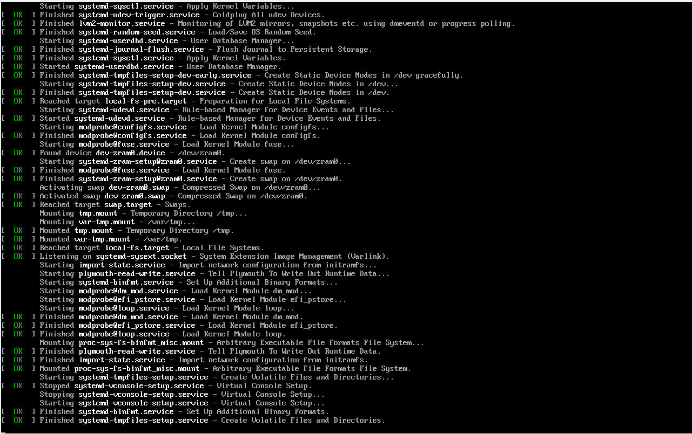
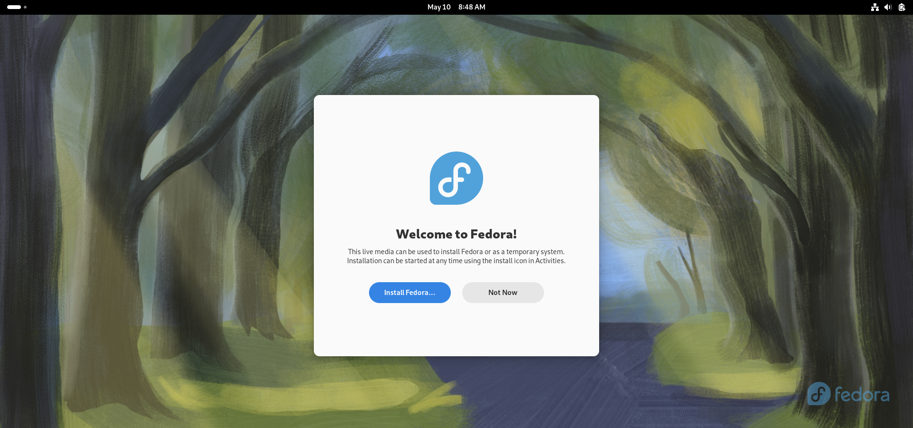
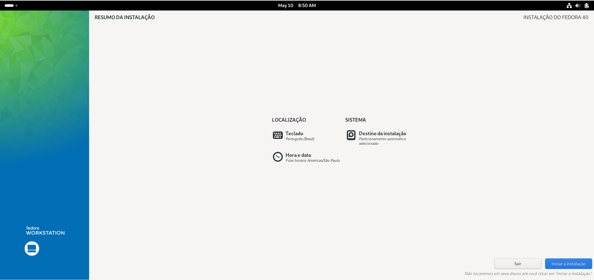
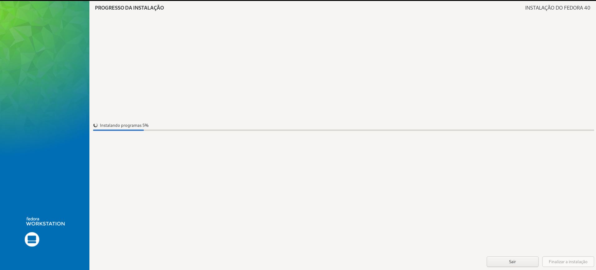
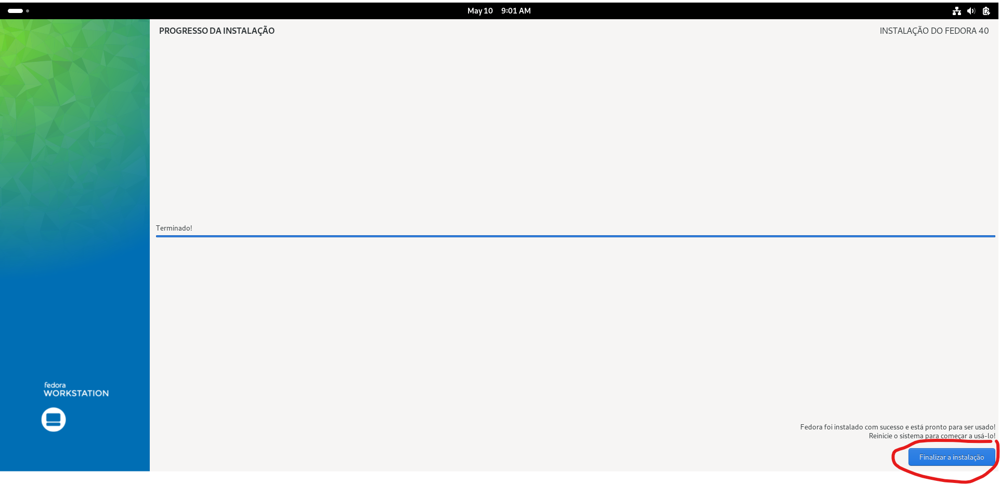

# Tutorial de como instalar o Sistema Operacional 'Fedora'

1° Passo:

Instalar o Sistema Operacional em sua máquina e aguarde a inicialização

2° Passo:

clique em 'Install Fedora'

3° Passo:

Configure seu idioma, Teclado, País e o Destino de instalação

4° Passo:

Após configurar o Idioma, Teclado, País e o Destino de instalação clique em 'Iniciar Instalação'

5° Passo:

Espere que o sistema conclua a instalação

6° Passo:

Clique em 'finalizar a instalação'

### Pronto, Agora só aproveitar o seu novo sistema operacional 'Fedora'!

